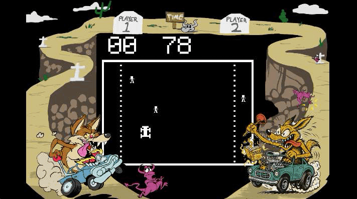

# DeathRace: Janky Jam Edition 🏎💀

A quick-and-dirty 3-day remake of the infamous 1976 *Death Race* arcade game — built in Unity as part of a personal jam to practice rapid prototyping, arcade AI, and classic 70s game feel.



---

## 🎯 Goal

Recreate the core gameplay loop in the shortest time possible:

* **Drive your deathmobile** around a walled playfield.
* **Run over gremlins** for points.
* **Avoid tombstones** that slow you down and trap you.
* All under a strict **80-second timer**.

This project intentionally embraces *jank* in visuals and code to focus on speed, iteration, and learning.

---

## 🕹 Features

* **Blocky steering delay** for that vintage arcade stiffness.
* **Gremlin AI** that roams randomly, with occasional stand-still “easy kills”.
* **Gremlin spawn limit** with timed respawn.
* **Slow zones** that cut your speed in half.
* **Tombstones** that slow you even more when touched.
* **Retro font & bezel** for 70s arcade vibes.
* Full game loop: start → play for 80 seconds → game over.

---

## 🛠 Tech

* **Engine:** Unity
* **Language:** C# (MonoBehaviour scripts)
* **Art:** Unity default shapes + Krita for quick edits
* **Font:** [Pixeleum](https://www.dafont.com/pixeleum.font) from DaFont

---

## 📦 Project Structure

```
/Assets
  /Scripts
    CarControl.cs
    GameController.cs
    GremlinControl.cs
    TimerControl.cs
  /Prefabs
    Car.prefab
    Gremlin.prefab
    Tombstone.prefab
  /Art
    Bezel.png
    Font/
  /Docs
    peek_1.gif
```

---

## 🚦 How to Play

* **W / Up Arrow** – Move forward
* **S / Down Arrow** – Reverse (slower)
* **A / Left Arrow** – Turn left
* **D / Right Arrow** – Turn right

Score as many gremlin hits as possible before time runs out. Avoid getting stuck in tombstone hell.

---

## 📌 Notes

* This is a jam build — code is *functional* but not optimized.
* Visuals are placeholder; future versions may replace assets.
* AI is intentionally simple to keep focus on core loop.

---

## 🗒 About This Build

This project was built over the course of **3 focused development days** as a rapid prototyping exercise. The goal was not polish, but **getting to a complete, playable loop** as fast as possible. Every feature was chosen for speed of implementation and clarity of gameplay rather than complexity.

A future, more ambitious remake is planned — possibly in 3D — but this jam version will stay frozen as a snapshot of the challenge.

---

## 📜 License

This project is licensed under the **GNU GPL-3.0 License** — you may copy, distribute, and modify it under the same license terms. See the [LICENSE](LICENSE) file for details.

---
